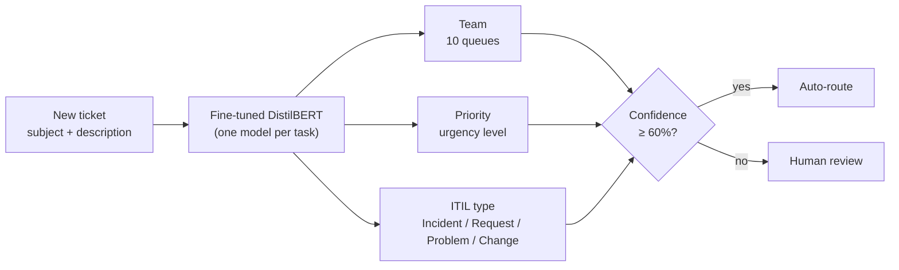
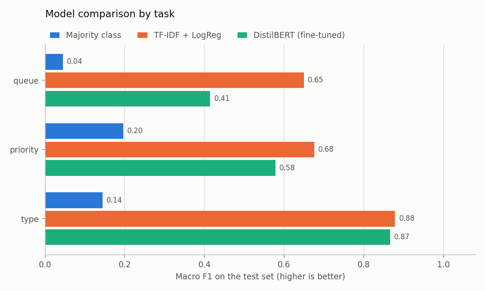
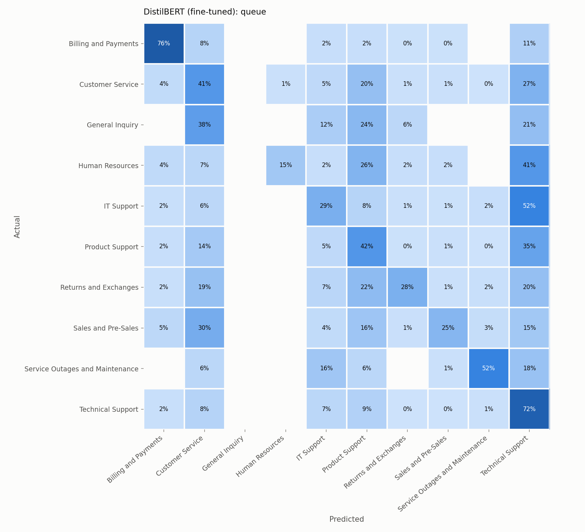
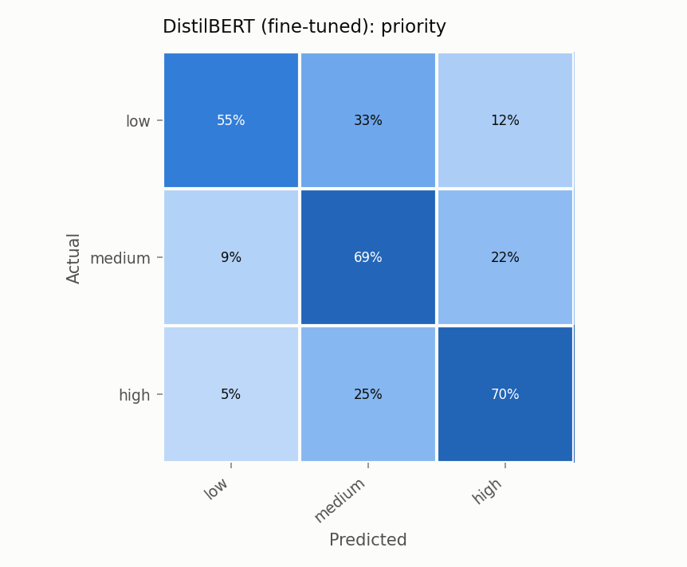
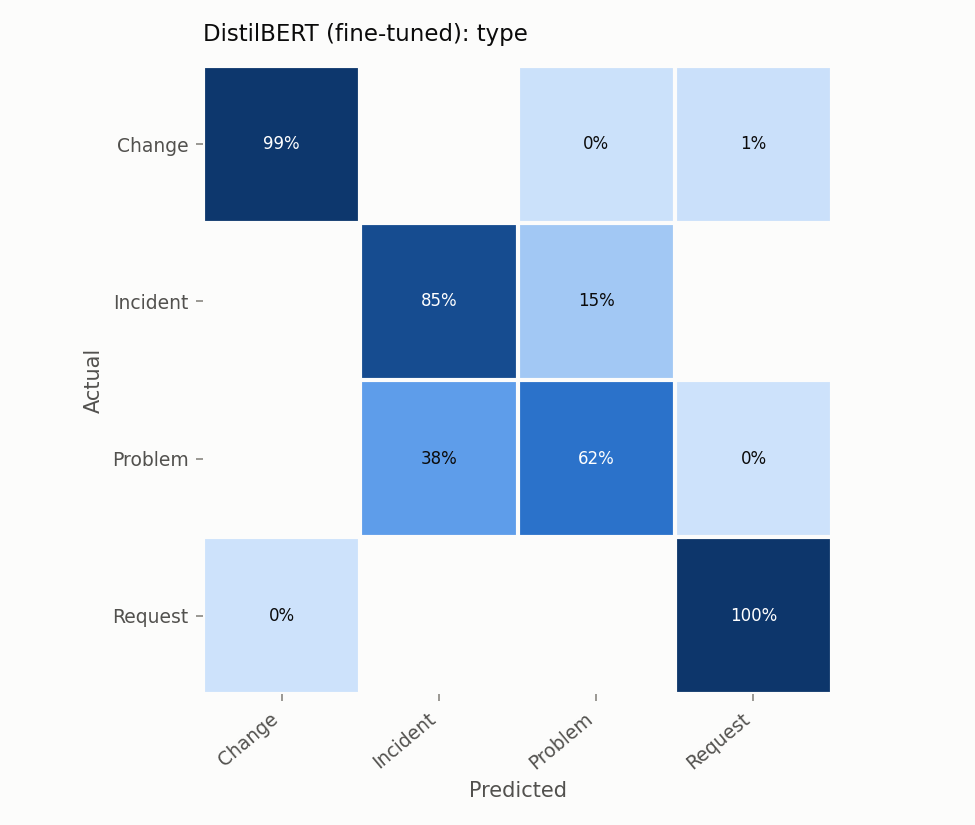
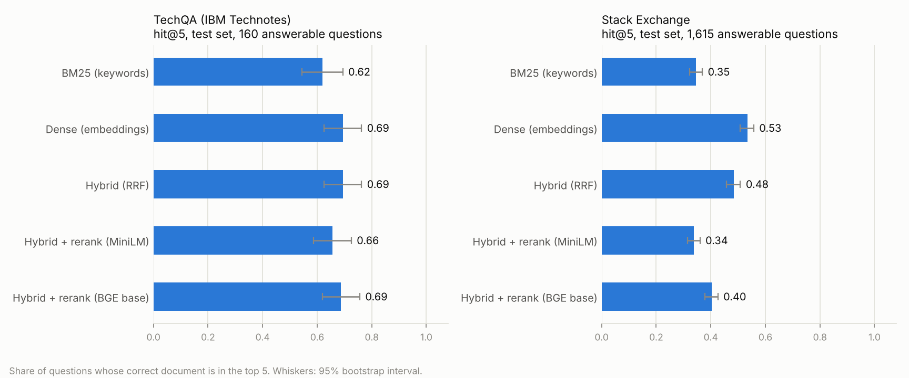
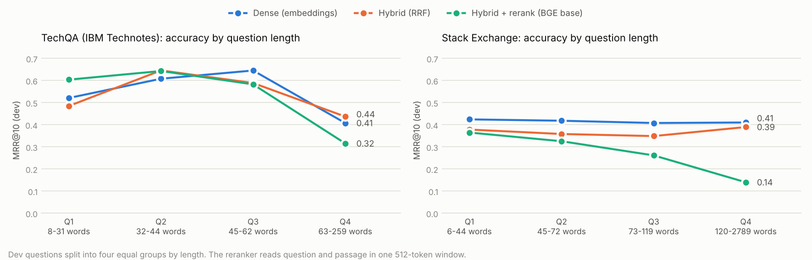

# Support Ticket Triage with DistilBERT

[](https://github.com/rushitpatel100-oss/ticket-triage-ai/actions/workflows/tests.yml)
[](https://colab.research.google.com/github/rushitpatel100-oss/ticket-triage-ai/blob/main/notebooks/train_on_colab.ipynb)


An NLP model that reads a support ticket and decides **which team should handle it**, **how urgent it is**
and **what ITIL ticket type it is** (Incident, Request, Problem or Change). Tickets the model is unsure about
are flagged for a human instead of being routed automatically.

Built with Hugging Face Transformers (fine-tuned DistilBERT), compared against classic machine-learning
baselines, and served through a Gradio web demo.

## Why I built this

Every service desk starts with the same step: reading an incoming request (a login problem, an access issue, a
platform error) and deciding where it should go. When a ticket lands in the wrong queue, it bounces between
teams and the user waits longer. This project asks: **how much of that first triage step can a small language
model do reliably, and how do we keep a human in the loop when it can't?**

## What it does



## Results

<!-- RESULTS:START -->
| Task | Model | Accuracy | Macro F1 | Weighted F1 |
|---|---|---|---|---|
| queue | Majority class | 0.289 | 0.045 | 0.130 |
| queue | TF-IDF + LogReg | 0.636 | **0.649** | 0.637 |
| queue | DistilBERT (fine-tuned) | 0.500 | 0.550 | 0.495 |
| priority | Majority class | 0.417 | 0.196 | 0.245 |
| priority | TF-IDF + LogReg | 0.683 | **0.675** | 0.683 |
| priority | DistilBERT (fine-tuned) | 0.664 | 0.654 | 0.663 |
| type | Majority class | 0.404 | 0.144 | 0.233 |
| type | TF-IDF + LogReg | 0.870 | 0.879 | 0.871 |
| type | DistilBERT (fine-tuned) | 0.898 | **0.904** | 0.897 |

*Scores on 2,375 held-out test tickets. Best macro F1 per task in bold.*








<!-- RESULTS:END -->

**Why macro F1?** Some teams receive far fewer tickets than others. Accuracy can look good while a model
ignores the small teams completely; macro F1 gives every class equal weight, so it exposes that.

## How it works

1. **Data** (`src/data.py`): the
   [Tobi-Bueck/customer-support-tickets](https://huggingface.co/datasets/Tobi-Bueck/customer-support-tickets)
   dataset has 61,765 synthetic tickets in English and German. I keep the English ones, join subject and body
   into one text and remove exact duplicate texts (so the same ticket can't appear in both training and test
   data). That leaves **23,748 tickets**, split 80/10/10 into train/validation/test (stratified by team).
2. **Baselines** (`src/baseline.py`): a majority-class model (the "do nothing" floor) and TF-IDF with
   logistic regression, with its regularisation strength tuned on the validation set.
3. **Fine-tuning** (`src/train.py`): `distilbert-base-uncased` fine-tuned separately for each task with the
   Hugging Face `Trainer`, for 6 epochs with a class-weighted loss (rare classes count more, the same idea as
   `class_weight="balanced"` in the baseline). The best epoch is chosen by validation macro F1.
   Each model takes about 10 minutes on a free Colab T4 GPU.
4. **Evaluation** (`src/evaluate.py`): accuracy, macro and weighted F1, a confusion matrix per task, and a CSV of
   the model's most confident mistakes for error analysis. Everything is measured on the untouched test set.
5. **Demo** (`app.py`): a Gradio app that shows the top predictions with confidence scores, the ITIL next
   step for the predicted ticket type, and a "needs human review" flag below 60% confidence.

## Quick start

### Option A: train on Google Colab (free GPU, recommended)

Click the **Open in Colab** badge above, switch the runtime to a T4 GPU and run the cells top to bottom.
The notebook trains everything, writes the results into this README and lets you download them.

### Option B: run on your own computer

```bash
git clone https://github.com/rushitpatel100-oss/ticket-triage-ai.git
cd ticket-triage-ai
python -m venv .venv && source .venv/bin/activate   # Windows: .venv\Scripts\activate
pip install -r requirements.txt

python -m src.data        # download and split the data
python -m src.baseline    # train the baselines (a few minutes on a laptop)
python -m src.train       # fine-tune DistilBERT (needs a GPU to be practical)
python -m src.report      # update the results table in this README
python app.py             # open http://127.0.0.1:7860
```

The demo works without a GPU: if no fine-tuned model is found, it falls back to the TF-IDF baseline.

### Run the tests

```bash
pip install -r requirements-dev.txt
pytest
```

The tests build a tiny dataset and a tiny model, so they run offline in seconds. They also run automatically
on every push through GitHub Actions.

### Live demo on Hugging Face Spaces (optional)

1. Upload the trained models to the Hub (last section of the Colab notebook).
2. Create a new Space with the **Gradio** SDK and upload `app.py`, `requirements.txt` and the `src/` folder.
3. In the Space settings, add the variables `MODEL_QUEUE`, `MODEL_PRIORITY` and `MODEL_TYPE`,
   e.g. `MODEL_QUEUE = your-hf-username/ticket-triage-queue`.

## Project structure

```
ticket-triage-ai/
├── app.py                      # Gradio demo
├── notebooks/
│   ├── train_on_colab.ipynb    # end-to-end training on a free GPU
│   └── prepare_real_data.ipynb # v2: download and check the real-world data
├── src/
│   ├── config.py               # all settings in one place
│   ├── data.py                 # download, clean, split
│   ├── baseline.py             # majority class + TF-IDF/logistic regression
│   ├── train.py                # DistilBERT fine-tuning
│   ├── evaluate.py             # metrics, confusion matrices, error analysis
│   ├── predict.py              # TicketClassifier used by the demo
│   ├── report.py               # writes the results table into this README
│   └── sources/                # v2: loaders for TechQA, Stack Exchange, ServiceNow log
├── docs/                       # v2 design and data card
├── tests/                      # offline end-to-end tests
├── results/                    # metrics, charts and error samples (committed)
├── requirements.txt
└── .github/workflows/tests.yml # CI
```

## Design decisions

- **DistilBERT** is 40% smaller and about 60% faster than BERT while keeping most of its accuracy, so it
  trains in minutes on a free GPU and can run on a CPU in the demo.
- **One model per task** keeps the code simple and lets each task pick its own best epoch.
  A shared multi-task model is a natural next step.
- **A baseline first.** If TF-IDF gets close to DistilBERT, the simpler model may be the better choice in
  production (cheaper, faster, easier to explain). The results table answers this with numbers.
- **Class-weighted loss.** The tickets are imbalanced (Technical Support is about 29% of tickets, General Inquiry about 1.4%).
  Without weighting, the transformer ignored the small teams. See the findings for the accuracy trade-off.
- **Human in the loop.** In a real service desk a wrong auto-route costs more than a manual check, so
  low-confidence predictions are sent to a person.

## Limitations

- The tickets are **synthetic**. Real tickets are messier (signatures, forwarded threads, screenshots), so
  scores on real data would likely be lower.
- English only. The dataset also has German tickets, which a multilingual model could handle.
- The 60% review threshold is a starting point, not tuned against the cost of a wrong route.

## Next steps

- Train longer and tune the learning rate for the team task, where validation F1 was still rising
- Repeat runs with several random seeds and report mean and spread
- Train a single multi-task model with three output heads
- Calibrate the confidence scores and pick the review threshold from the validation data
- Add German with a multilingual model such as `distilbert-base-multilingual-cased`
- Connect to a ticketing tool's API (e.g. Jira) to suggest a queue when a ticket is created

## What I found

Each number comes from a single training run on one fixed split, so small gaps (a point or two) should not be over-read.

- **A bigger model is not automatically better.** TF-IDF + logistic regression beat DistilBERT on team (0.65 vs 0.55 macro F1)
  and was slightly ahead on priority (0.68 vs 0.65). DistilBERT only won on ITIL type (0.90 vs 0.88).
- **My first comparison was unfair, and fixing it mattered.** In the first run the baseline used balanced class weights and
  DistilBERT did not, with 3 epochs. DistilBERT scored 0.00 F1 on the rare *General Inquiry* team and 0.41 macro F1 overall on
  team. Adding a class-weighted loss and training for 6 epochs lifted that to 0.52 and 0.55. Team validation F1 was still rising
  at epoch 6, so more training would probably help further.
- **Class weighting has a price.** Overall accuracy on team fell from 0.51 to 0.50 even as macro F1 rose, because the biggest team,
  *Technical Support*, now has only 35% recall: 22% of those tickets go to *IT Support*, 16% to *Product Support*
  and 15% to *Customer Service*. Which metric matters depends on what a wrong route costs.
- **Team confusions make sense.** Most of the confusion in the matrices involves *Technical Support*, *Product Support*,
  *IT Support* and *Customer Service*, teams whose descriptions overlap, so some tickets are genuinely ambiguous.
- **ITIL *Problem* vs *Incident* is the hard part of type.** *Request* and *Change* are near-perfect (F1 0.98 to 1.00).
  *Problem* is the weakest class (F1 0.70 baseline, 0.75 DistilBERT); the baseline sends 28% of Problems to *Incident*
  and 17% of Incidents to *Problem*.
- **Confident mistakes often look like label noise.** Reading the most confident team errors (`results/errors_queue_*.csv`):
  several tickets about "service disruptions" or "service outages" are labelled *Technical Support* or *Product Support*, while
  the model predicts *Service Outages and Maintenance*, which is arguably the better answer. I read only the top handful, so
  this is an observation, not a measured noise rate.

## v2 (in progress): resolve, assist or escalate

The next version turns the classifier into an AI service desk agent: for each ticket it decides whether
it can **resolve it by itself**, **draft an answer for an agent**, or **escalate it** to the right team,
and logs why. See the [design](docs/v2-design.md).

Because the routing data is synthetic, v2 adds real-world data, each used for what it is real for
([data card](docs/DATA_CARD.md)):

- **TechQA**: 910 real IBM support-forum questions and 28,481 IBM Technotes. A third of the questions
  have no answer in the documents, the real "escalate" case.
- **Stack Exchange** (Super User, Ask Ubuntu): 40,000 real questions with accepted answers.
- **A real ServiceNow incident log** (24,918 incidents): 45.6% were reassigned at least once, which is the
  cost that better routing targets.

### Step 1 done: finding the right knowledge article

Four retrieval methods compared on the real knowledge bases (`python -m src.retrieval`, full write-up in
[docs/RETRIEVAL.md](docs/RETRIEVAL.md)). Methods are chosen on dev questions; test is reported separately.

<!-- RETRIEVAL:START -->
**TechQA (IBM Technotes)**: 28,481 documents (89,614 passages); 450 dev and 160 test questions that have an answer.

| Method | Dev hit@5 | Dev MRR@10 | Test hit@5 | Test MRR@10 | Test hit@5 95% CI | ms per query |
|---|---|---|---|---|---|---|
| BM25 (keywords) | 0.57 | 0.49 | 0.62 | 0.51 | 0.54–0.69 | 1 |
| **Dense (embeddings)** | 0.63 | 0.54 | 0.69 | 0.56 | 0.63–0.76 | 4 |
| Hybrid (RRF) | 0.63 | 0.54 | 0.69 | 0.58 | 0.63–0.76 | 6 |
| Hybrid + rerank (MiniLM) | 0.66 | 0.52 | 0.66 | 0.53 | 0.59–0.73 | 142 |
| Hybrid + rerank (BGE base) | 0.63 | 0.54 | 0.69 | 0.55 | 0.62–0.76 | 438 |

Paired difference in dev MRR@10 against hybrid (bootstrap over questions, 95% interval):

- BM25 (keywords): -0.047 (-0.069 to -0.026), worse
- Dense (embeddings): +0.005 (-0.023 to +0.033), no clear difference
- Hybrid + rerank (BGE base): -0.002 (-0.031 to +0.029), no clear difference
- Hybrid + rerank (MiniLM): -0.024 (-0.055 to +0.005), no clear difference

**Stack Exchange (Super User, Ask Ubuntu)**: 32,025 documents (38,350 passages); 3,154 dev and 1,615 test questions that have an answer.

| Method | Dev hit@5 | Dev MRR@10 | Test hit@5 | Test MRR@10 | Test hit@5 95% CI | ms per query |
|---|---|---|---|---|---|---|
| BM25 (keywords) | 0.35 | 0.27 | 0.35 | 0.28 | 0.32–0.37 | 1 |
| **Dense (embeddings)** | 0.53 | 0.42 | 0.53 | 0.43 | 0.51–0.56 | 3 |
| Hybrid (RRF) | 0.47 | 0.37 | 0.48 | 0.38 | 0.46–0.51 | 4 |
| Hybrid + rerank (MiniLM) | 0.34 | 0.24 | 0.34 | 0.25 | 0.32–0.36 | 71 |
| Hybrid + rerank (BGE base) | 0.38 | 0.27 | 0.40 | 0.29 | 0.38–0.43 | 213 |

Paired difference in dev MRR@10 against hybrid (bootstrap over questions, 95% interval):

- BM25 (keywords): -0.094 (-0.103 to -0.085), worse
- Dense (embeddings): +0.046 (+0.035 to +0.058), better
- Hybrid + rerank (BGE base): -0.095 (-0.109 to -0.082), worse
- Hybrid + rerank (MiniLM): -0.125 (-0.137 to -0.112), worse

Models: `BAAI/bge-small-en-v1.5` embeddings; rerankers `cross-encoder/ms-marco-MiniLM-L-6-v2`, `BAAI/bge-reranker-base`. Timed on a Tesla T4 in half precision.
<!-- RETRIEVAL:END -->



What it showed:

- **Embedding search is best or tied, and cheap** (3 to 4 ms per question). Adding keyword search (hybrid)
  gave no gain on IBM's documents and lost accuracy on Stack Exchange.
- **Off-the-shelf rerankers did not help** and were about 19 to 75 times slower: no clear difference on
  IBM's documents, clearly worse on Stack Exchange. A big part of the reason: a reranker reads question and
  answer through one 512-token window, so long tickets with logs crowd the answer out. On the longest
  quarter of Stack Exchange questions the BGE reranker's MRR fell to 0.14, against 0.39 for hybrid.
- **Caveat:** the embedding model was trained partly on Stack Exchange data, so its lead there is probably
  optimistic; IBM's Technotes are the fairer test.



Next: the resolve-or-escalate model (does the knowledge base actually answer this ticket?), then the
LLM step and guardrails.

## Dataset and licence

Data: [Tobi-Bueck/customer-support-tickets](https://huggingface.co/datasets/Tobi-Bueck/customer-support-tickets)
on Hugging Face, a synthetic dataset licensed under
[CC BY-NC 4.0](https://creativecommons.org/licenses/by-nc/4.0/). The data is downloaded by the scripts; only small
samples of misclassified tickets are kept in `results/` for error analysis.

Code: MIT licence, see [LICENSE](LICENSE).
