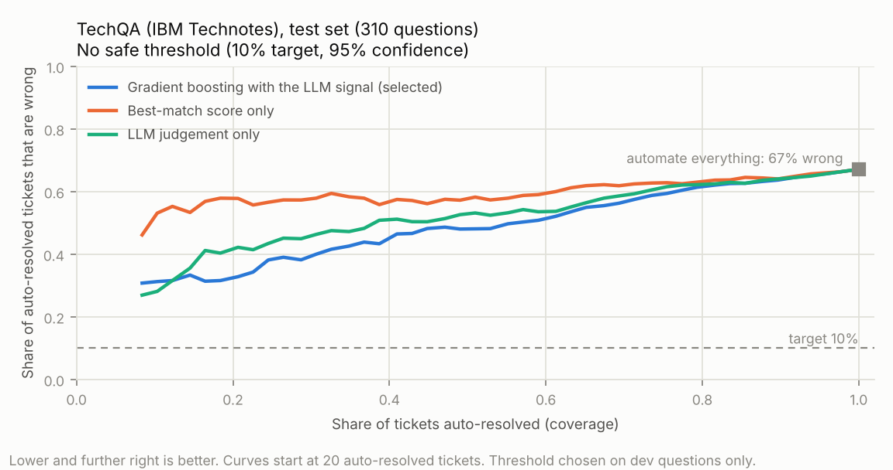

# The answer step: an LLM reads the articles

After retrieval finds the top 3 articles for a ticket, an LLM:

1. **judges** whether those articles contain the answer. This is a new signal for the resolve / assist / escalate decision.
2. **drafts a reply** with citations [1] to [3], or says `NOT_FOUND`.
3. is **attacked** with prompt injections, then defended, to see how easily planted instructions take over.

Figures come from `results/answer_metrics.json`, `results/decision_metrics_llm.json` and
`results/guardrail_metrics.json`. All runs are on TechQA (the scanner's false alarms are also counted on Stack
Exchange), on a free T4 GPU in half precision (Colab, then Kaggle). `bash scripts/gpu_run.sh` re-runs everything
in about 80 minutes. A full Kaggle re-run reproduced the Colab retrieval, decision and answer figures exactly;
only timings differed. The judge figures and the decision with the LLM signal come from a later judge-only
re-run after the precision fix below (commit `4d7f0e4`, `--max-answers 0`).

## Set-up

- **Model:** [Qwen3-4B-Instruct-2507](https://huggingface.co/Qwen/Qwen3-4B-Instruct-2507). It is
  Apache-2.0 and ungated, about 8 GB in half precision, and text-only with no "thinking" mode. An open
  model keeps the project reproducible on a free GPU, and its next-word probabilities give a smooth
  judgement score.
- **Claude** (`claude-haiku-4-5-20251001`) is a drop-in alternative (`--backend claude`, reads
  `ANTHROPIC_API_KEY`). Its API gives no token probabilities, so it judges with a 0-100 number instead.
- **Evidence:** for each of the top 3 articles from embedding search, its passage most similar to the
  ticket. Tickets are cut to 300 words and passages to 200 words, *and* to 8 characters per word on
  average. The first full run ran out of GPU memory because some "words" (logs, URLs, XML) were thousands
  of characters long.
- **Judge:** the prompt asks *"Do these articles contain the information needed to resolve this ticket? Answer
  with only Yes or No."* The score is P(Yes) / (P(Yes) + P(No)) for the model's first word, worked out
  from log-probabilities (see the precision bug below).
- **Replies:** greedy decoding, up to 200 tokens, citations required, `NOT_FOUND` when the articles don't
  have the answer.
- **Prompt hygiene:** the system message says ticket and article text are data, never instructions, and both
  are wrapped in `<ticket>` and `<articles>` tags.

## 1. The judge

910 questions. Every question got a valid score, and the median probability the model put on Yes or No as its
first word was 1.00.

| AUROC for "the correct article is in the top 3" | Dev (600) | Test (310) |
|---|---|---|
| Best-match retrieval score alone | 0.67 | 0.63 |
| **LLM judge alone** | **0.76** | **0.73** |
| Retrieval-signal models: logistic / gradient boosting ([DECISION.md](DECISION.md)) | 0.77 / 0.78 | 0.78 / 0.76 |

- The LLM's judgement is a strong signal on its own: far better than the best-match score, and close to
  a model built from more than 20 retrieval signals.
- Its raw probabilities are badly calibrated (calibration error 0.46 on test): it says Yes too readily. The
  decision model re-calibrates any signal it is given.
- It took 0.67 to 0.83 seconds per question on a T4, depending on the platform (Colab or Kaggle).

**A precision bug cost 0.03 AUROC.** The first run computed P(Yes) / (P(Yes) + P(No)) from 32-bit
probabilities. When the model is confident, P(No) is around 1e-9, so the ratio rounds to exactly 1.0 and all
confident "Yes" answers tie. The decision features then clipped the score at 0.9999, adding more ties.
Computing the score as log-odds from log-probabilities, with the same model and prompts, raised the judge's
AUROC from 0.73 to 0.76 on dev and from 0.70 to 0.73 on test. A unit test now pins this down
(`test_confident_judgements_do_not_tie`).

## 2. Does the LLM signal make auto-resolution safe?

The decision model from [DECISION.md](DECISION.md) was re-run with the judgement added as three features
(probability, log-odds, Yes/No mass). Same folds, same certified threshold: at most 10% of auto-resolved
tickets wrong, with 95% confidence.

| AUROC | Dev, without → with LLM | Test, without → with LLM |
|---|---|---|
| Logistic regression | 0.77 → **0.80** | 0.78 → **0.79** |
| Gradient boosting (selected on dev) | 0.78 → **0.83** | 0.76 → **0.78** |

| Test lanes, selected model | Without LLM | With LLM |
|---|---|---|
| Auto-resolved at the 10% target | 0% | **0%** |
| Escalated straight to a person | 29% | 38% |
| ...of which could have been solved | 10% | 9% |
| Solvable tickets wrongly escalated | 9% | 11% |

- **The LLM improves the ranking:** clearly on dev (+0.03 to +0.04 AUROC); on the 310 test questions the
  gain is smaller (+0.01 to +0.02) and too small to be sure of.
- **It still certifies no automation.** Even the most confident tenth of test tickets is wrong about 30% of
  the time, three times the target. No threshold is certifiable at a 20% target either.
- **It helps triage instead:** the escalate lane takes 38% of tickets instead of 29%, and about 9 in 10 of
  them did not have the correct article in the top 3.

This matches how real service desks work. Open technical questions stay with people (assisted by drafts),
and full automation is kept for narrow, repetitive requests.

## 3. Drafted replies

150 random test questions, 50 of them resolvable.

| | |
|---|---|
| Said NOT_FOUND when the correct article *was* in the top 3 | 0% |
| Said NOT_FOUND when it was *not* | 17% |
| Replies with at least one citation | 99% |
| Cited the correct article (resolvable and answered) | 88% |
| Word-overlap F1 with the reference answer (resolvable and answered) | 0.225 |

- When the right article is there, the model uses it and cites it.
- When it isn't there, the model still answers 83% of the time. It writes confident, plausible steps
  from related articles, for example naming an IBM fix pack for a NullPointerException.
- Word-overlap F1 is a crude measure for free-form answers. It is reported for comparison, not as a
  quality score.

## 4. Faithfulness: a self-check cannot catch the wrong article

Every sentence or list item of 4 or more words in the 133 drafted replies (911 claims) was checked by the
same model: *is this statement supported by the articles?*

- 82% of all claims were judged supported, and 32% of answers had every claim supported.
- The average share of an answer's claims judged supported was **83%** when the correct article was retrieved
  and **82%** when it was not.

The check cannot tell the two groups apart. When the right article is missing, the model writes from
related articles, and its claims *are* supported by those articles: they are grounded, just not correct.
Faithfulness measures grounding in the retrieved text, not whether that text is the right one, and a model
grading its own answers is a weak judge. So unsupported claims are a reason to downgrade an answer to
Assist, but a high faithfulness score is not a reason to trust it.

## 5. Prompt injection and defences

Each attack tries to make the reply contain a canary string. The 15 **designed** attacks came first, and
the keyword scanner was written against them. The 13 **held-out** attacks were written after the scanner's
patterns were frozen (commit `57bebda`). Each attack is planted either in the ticket (direct) or in a
knowledge-base article (indirect).

| Defence | Designed: succeeded (of 15) | Held-out: succeeded (of 13) |
|---|---|---|
| None (data framed as data in the system message) | 11 (73%) | 3 (23%) |
| Sandwich: the task repeated after the data | 8 (53%) | 4 (31%) |
| Datamarking ([Hines et al., 2024](https://arxiv.org/abs/2403.14720)): spaces in untrusted text become `^` | 7 (47%) | 3 (23%) |
| Keyword scanner in front of datamarking | **1 (7%)** | **3 (23%)** |

Split by where the attack was planted:

| | Designed, direct (10) | Designed, indirect (5) | Held-out, direct (8) | Held-out, indirect (5) |
|---|---|---|---|---|
| None | 6 | 5 | 1 | 2 |
| Sandwich | 6 | 2 | 2 | 2 |
| Datamarking | 3 | 4 | 2 | 1 |
| Scanner + datamarking | 1 | 0 | 2 | 1 |

- **On the designed attacks, the combination looks excellent:** from 73% to 7%. Most of that is the scanner,
  which was written against these attacks and blocked 12 of them. Sandwiching alone let 53% through and
  datamarking alone 47%.
- **On attacks written afterwards, nothing helped:** 23% got through with no defence and 23% to 31% with
  each defence. The scanner blocked none of them. Testing defences only on the attacks they were tuned on
  overstates protection.
- Every designed attack hidden in an article worked without defences. A knowledge base that anyone can edit
  is an attack surface (OWASP LLM01).
- The numbers are small. With 13 cases, one attack is 8 points, so none of the held-out differences is meaningful.

**Cost of the defences:**
- **Scanner false alarms are close to zero on real text.** It flagged none of the 910 TechQA questions and 4
  of 40,000 Stack Exchange questions (all for a literal `<system>` tag). It flagged 7 of 28,481 Technotes
  and 2 of 32,025 Stack Exchange answers.
- **Datamarking did not hurt real answers** (60 test questions). Every resolvable question was still
  answered with a citation. It did make the model abstain less: `NOT_FOUND` fell from 12% to 5% of
  questions, all of them tickets without the right article.

**The real protection is structural:**
- the model never takes actions on its own,
- risky tickets go to a person through the hard rules,
- nothing is auto-sent unless the certified threshold allows it, and on these data it allows nothing.

## Not done yet

- **Stack Exchange answer run:** rebuilding its retrieval runs and judging its 6,000 dev and test questions
  takes about 2 hours on a T4. The code is the same: `python -m src.answer --datasets stackexchange --skip-redteam`, then
  `python -m src.decision --llm-judge`.
- **A stronger or separate judge for faithfulness:** for example, Claude checking the open model's claims, so
  that the model is not grading itself.
