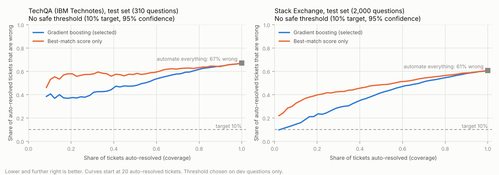

# Resolve, assist or escalate

For every ticket the system picks one of three lanes:

- **auto**: the AI answers on its own,
- **assist**: the AI drafts an answer and an agent checks it,
- **escalate**: straight to a person, because the knowledge base probably has nothing useful.

This step builds that decision on the real retrieval results and measures how far it can safely go.
Figures come from `results/decision_metrics.json` (rebuild with `python -m src.decision`).

## How it works

**Label.** A ticket is *resolvable* when the correct article is among the top 3 that embedding search
returns, the articles the answer step will read. Unanswerable questions (TechQA's own label, or Stack
Exchange questions whose answer was removed from the knowledge base) are never resolvable.

**Signals** (`src/decision/features.py`), all available before anyone answers:
- for each retriever (embeddings, keywords, hybrid, both rerankers): best score, gap to the second, and how
  far the best score stands out from the rest of the list,
- agreement: where keyword search, hybrid and the rerankers rank the embedding search's top article, the
  overlap of the embedding and keyword top-5 lists, and the share of methods that agree on the top article,
- question shape: length, number of lines, share of code-like characters.

**Models.** The best-match score alone (the obvious baseline), logistic regression and gradient boosting.
Each is scored with 5-fold cross-fitted predictions on dev (train + validation), so every dev ticket is
judged by a model that never saw it. The better of the two learned models by average precision is selected.

**Thresholds**, chosen on dev only:
- **Auto-resolve** at the loosest threshold at which at most **10%** of auto-resolved tickets would be
  wrong, **with 95% confidence**. This uses selection with guaranteed risk
  ([Geifman & El-Yaniv, 2017](https://arxiv.org/abs/1705.08500)): a binary search tests about log2(n)
  thresholds (10 for TechQA, 12 for Stack Exchange), each with a Clopper-Pearson upper bound at a
  Bonferroni-corrected level, and keeps the loosest one that passes. If none passes, nothing is auto-resolved.
- **Escalate** below the score that keeps 90% of resolvable tickets in the auto or assist lanes.

**Hard rules** (`src/decision/policy.py`) run on top and can only make a decision more cautious:
- security wording (phishing, malware, breach and similar) and legal or personal-data requests (GDPR,
  subject access request, legal hold, subpoena) go to **escalate**,
- privileged-access requests, data deletion, ITIL changes and urgent tickets get **at least assist**.

Every decision carries its reasons: the confidence, the threshold it was compared with, and any rule that
fired. Two real test decisions:

- TechQA, *"Web GUI 8.1 FP7 requires DASH 3.1.2.1 or later…"* → **assist**: *"confidence 0.357; no
  auto-resolve threshold met the error target on past tickets: draft an answer for an agent"*.
- TechQA, *"Error #2070. I purchased the SPSS grad pack…"* → **escalate**: *"confidence 0.057 is below
  0.112: the knowledge base probably has no answer"*. (Right call: its correct article was not in the top 3.)

**Does the guarantee hold?** A simulation in the tests calibrates the threshold on 200 independent samples of
2,000 tickets with a known true error rate. 142 samples found a threshold, and in none of them did the true
error rate exceed 10% (worst 9.7%, median 5.5%). The other 58 declined to automate anything. The method is
cautious by design.

## Results (test set, never used for any choice)

| | TechQA (IBM) | Stack Exchange |
|---|---|---|
| Questions (dev / test) | 600 / 310 | 4,000 / 2,000 |
| Resolvable (dev → test) | 43.8% → 32.9% | 36.7% → 39.4% |
| Wrong if everything were automated | 67.1% | 60.6% |
| AUROC, best-match score only | 0.63 | 0.67 |
| AUROC, logistic regression | 0.78 | 0.77 |
| AUROC, gradient boosting (selected on dev) | 0.76 | 0.77 |
| **Auto-resolved at the 10% target** | **0%** (no threshold passed) | **0%** (no threshold passed) |
| Escalated without a draft (selected model) | 28.7% of tickets, 10.1% of them resolvable | 18.8% of tickets, 14.9% of them resolvable (19.8% once the rules add security tickets) |
| Resolvable tickets wrongly escalated | 8.8% | 7.1% |

## What we learned

**1. Retrieval confidence alone cannot certify safe automation of open technical questions.** No threshold
kept wrong automations under 10% with 95% confidence on either knowledge base. The curves show why:
- **TechQA:** even the 8% of IBM questions the model is most sure about are about 38% wrong.
- **Stack Exchange:** the best region is roughly 10% wrong at 2% coverage, and wrong automations reach
  about 15% by 10% coverage.

**2. A looser target does give automation, and it holds on test.** At a 20% target the gradient boosting
model auto-resolves 12.5% of dev tickets on Stack Exchange; on test it auto-resolved 13.6%, of which 17.3%
were wrong, inside the 20% target. On TechQA even 20% is out of reach.

**3. The signals are useful for triage.** Every learned model beats the best-match score alone (AUROC 0.76 to
0.78 against 0.63 to 0.67). The escalate lane works:
- **TechQA:** the selected model sends 28.7% of tickets straight to a person, and only 10.1% of those
  could have been solved, against 32.9% overall.
- **Stack Exchange:** it sends 18.8% straight to a person, of which 14.9% were solvable, against 39.4%
  overall.
- In both, fewer than 9% of solvable tickets are wrongly escalated.

**4. Rerankers earn their place as signals.** They lost as rankers (see [RETRIEVAL.md](RETRIEVAL.md)), but in
the logistic model for TechQA two of the four strongest signals are reranker-based:
- where the BGE reranker places the embedding search's top article (coefficient −0.305: the further down,
  the less likely it is right),
- MiniLM's score gap (+0.305).

The strongest, the share of methods that agree on the top article (+0.334), also counts the rerankers. On
Stack Exchange the strongest signal is the gap between embedding search's first and second result (+0.395).

**5. It transfers to a new knowledge base.** The Stack Exchange model, applied unchanged to IBM's questions,
scores AUROC 0.78, as good as models trained on TechQA itself. Its probabilities are badly calibrated there
(calibration error 0.20), and its thresholds escalate only 8.1% of tickets. So a new deployment can reuse the
ranking but needs its own thresholds.

**6. Shift breaks calibration.** TechQA's test set has far more unanswerable questions than its dev set
(48% against 25%). The logistic model's calibration error rises from 0.04 on dev to 0.13 on test: its probabilities stop
matching the observed rates as soon as the mix of tickets changes. A live system needs monitoring of the resolvable
rate and periodic re-calibration.

**7. The rules rarely fire on forum questions.** Only the text rules can fire here (forum questions have
no priority or ITIL type). None of the 310 TechQA test questions matched one. 37 of
the 2,000 Stack Exchange questions did (27 security wording, 6 privileged access, 5 data deletion; one
question matched two). Forum posts are not internal help-desk tickets, so this says little about rule
coverage in a real service desk.

## Caveats

- "Resolvable" is a retrieval-level proxy. A ticket whose correct article is in the top 3 can still get a
  bad answer, and one without it might still be answered from another article. The answer step measures
  that directly.
- The 95% guarantee assumes new tickets look like the calibration tickets, and the cross-fitted
  calibration makes it approximate. Point 6 shows what happens when they don't.
- Stack Exchange "unanswerable" labels are simulated (20% of answers removed) and slightly noisy.

## What this means for the next step

Real service desks automate narrow, repetitive request types (password resets, access to a known system),
not open technical questions like these. To raise the safe auto-resolve rate the system needs an
**answer-level check**: the LLM reads the top three articles, answers with citations, and says whether
the articles actually contain the answer. That judgement becomes a new signal, and the same certified
threshold is re-run to see whether any automation becomes safe.

**Result** ([ANSWER.md](ANSWER.md)): on TechQA the LLM judgement raised dev AUROC from 0.78 to 0.83 and let the
escalate lane take 38% of tickets instead of 29%, but still no threshold met the 10% target. The most confident
tenth of tickets was still wrong about 30% of the time.
